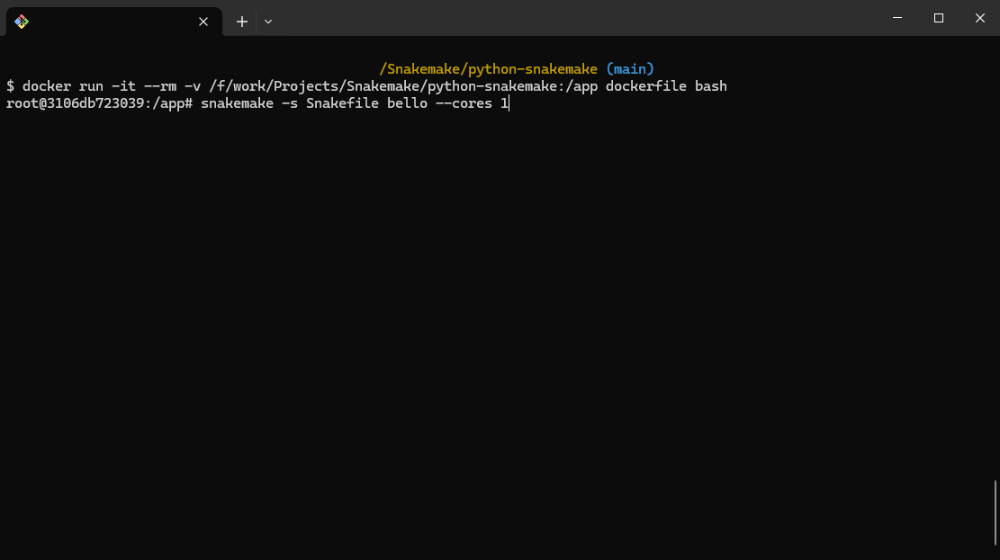
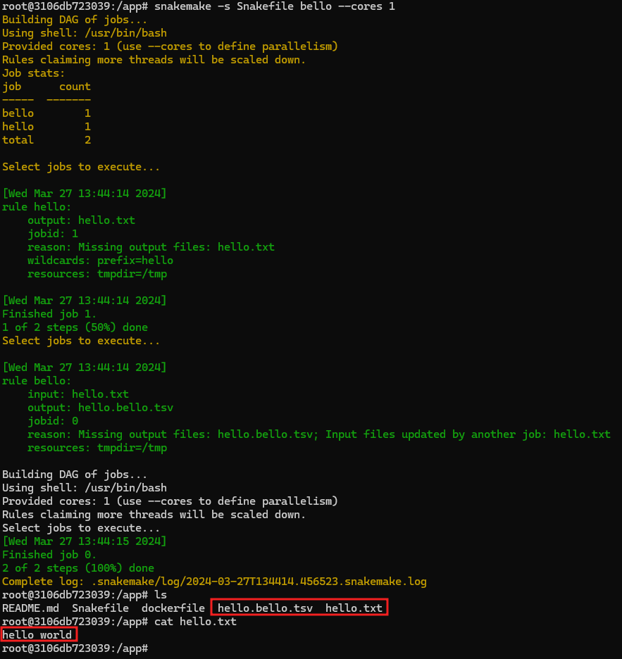
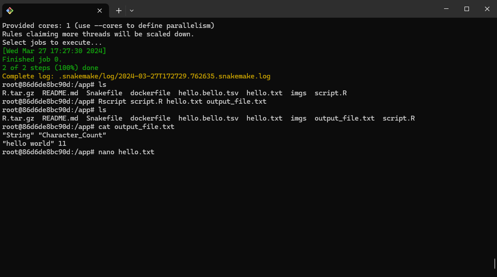

# Snakemake DEMO

## Purpose

This repository contains a Snakemake definition file (`Snakefile`) for the construction of various files using the Snakemake workflow management system. The rules specified in the `Snakefile` define how to generate output files from input files or by performing specific operations.

## Setup

To run the Snakemake workflow, you'll need to have Snakemake installed along with Python library. You can install Snakemake using pip:

## Execution

1. Clone this repository:

```bash
git clone [repository_url](https://github.com/felixsuarez0727/python-snakemake.git)
cd python-snakemake
```

2. Ensure you have the required input files specified in the rules.

   - For the `bello` rule, ensure you have a file named `hello.txt` in the directory.

3. Execute Snakemake with the desired number of cores using the following command:

Replace `<num_cores>` with the number of CPU cores you want to allocate for the execution. For example, to use a single core:

## Understanding the Execution

The command `snakemake --cores 1 hello.bello.tsv` specifies the following:

- `snakemake`: Invokes the Snakemake workflow management system.
- `--cores 1`: Specifies the number of CPU cores to be used for execution. In this case, it's set to 1 core.
- `hello.bello.tsv`: Specifies the target output file that we want to generate using the rules defined in the `Snakefile`.

Running this command initiates the Snakemake workflow, which follows the rules defined in the `Snakefile` to generate the specified output file `hello.bello.tsv`.

## Docker Image

This project includes a Docker image for running the Snakemake workflow in an isolated environment. Follow the steps below to build and run the Docker image:

1. Build the Docker image:

```bash
docker build -t dockerimage .
```

2. Run the Docker Container:

```bash
docker run -it --rm -v /f/work/Projects/Snakemake/python-snakemake:/app dockerfile bash
```

- The `docker run` command initializes a Docker container from the `snakemake-demo` image.
- The `-v $(pwd):/app` flag mounts the current directory into the container at the `/app` directory, ensuring accessibility to project files.
- `snakemake-demo` specifies the Docker image to use.
- `snakemake -s Snakefile --cores 1 all` is the command executed within the container:

```bash
snakemake -s Snakefile bello --cores 1
```

- `snakemake` invokes the Snakemake workflow management system.
- `-s Snakefile` specifies the Snakefile to use for the workflow.
- `--cores 1` dictates the number of CPU cores allocated for execution.
- `all` directs Snakemake to execute all rules defined in the Snakefile.

```bash
Rscript script.R hello.txt output_file.txt
```

- ` Rscript` : Command to execute an R script.
- ` script.R` : The R script to execute.
- ` hello.txt` : Input file for the R script.
- ` output_file.txt` : Output file generated by the R script.

## Understanding the Execution:

The Docker container runs the Snakemake workflow, utilizing the specified number of CPU cores to execute all rules defined in the Snakefile.
Upon successful execution, the workflow generates output files according to the defined rules. The R script script.R, passes hello.txt as `input` and `output_file.txt` as the desired output file. The R script processes the input file and generates the specified output file with the desired results which is a count of characters within the input.

## Results

After running the Snakemake workflow within the Docker container, various output files are generated as per the rules outlined in the Snakefile. Here's an example showcasing the results:

| Before Execution                           | After Execution                              |
| ------------------------------------------ | -------------------------------------------- |
|  |  |

| Rscript Result                                        |
| ----------------------------------------------------- |
|  |
